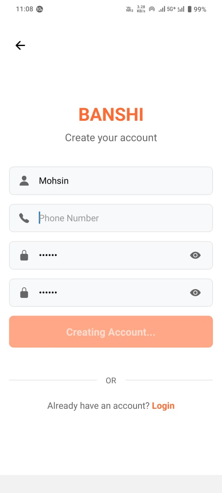
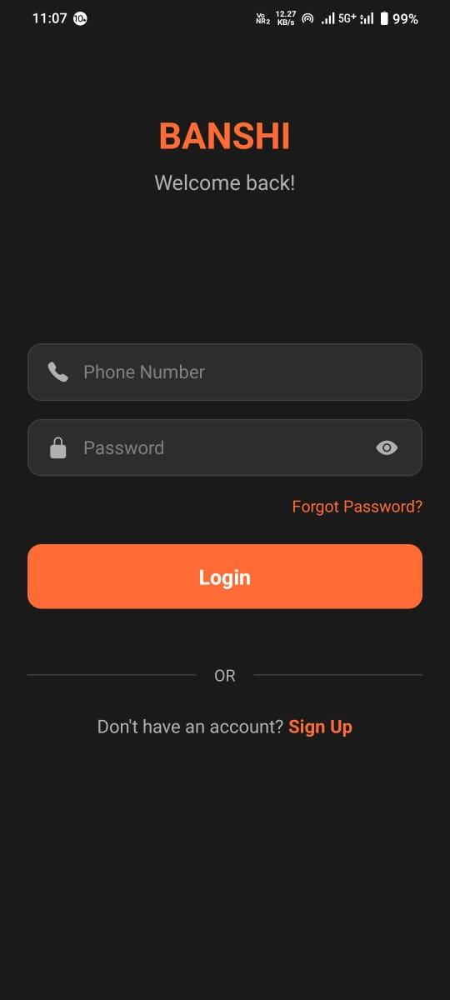
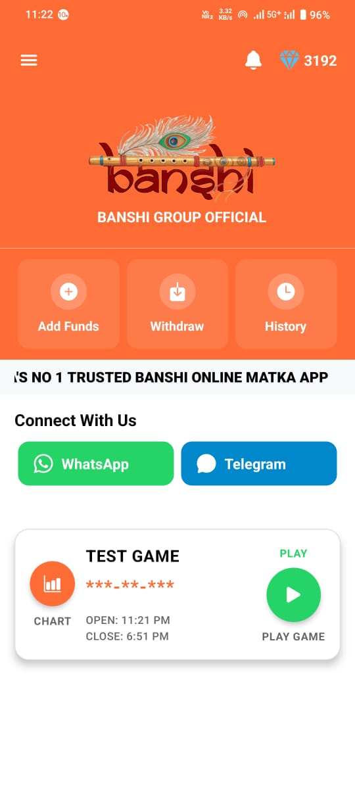

# 🎯 BANSHI - Number Prediction Gaming App

A modern, feature-rich mobile application built with React Native and Expo for playing various number-based games with real-time betting and wallet management.

   


## ✨ What is BANSHI?

BANSHI is a mobile gaming app that offers multiple number-based games where users can place bets and potentially win rewards. It's designed with a clean, intuitive interface and includes features like wallet management, game history, and real-time updates.

## 🎮 Available Games

### 1. **Single Digit** (0-9)
- Choose any single digit from 0 to 9
- Place bets on OPEN or CLOSE timing
- Simple and straightforward gameplay

### 2. **Jodi Digit** (00-99)
- Bet on two-digit combinations
- Choose from 00 to 99
- Higher rewards for correct predictions

### 3. **Panna Games**
- **Single Panna**: 3-digit numbers (000-999)
- **Double Panna**: 3-digit numbers with special rules
- **Triple Panna**: 3-digit numbers with enhanced rewards

### 4. **Sangam Games**
- **Half Sangam**: Combine digit with panna (e.g., 1-123)
- **Full Sangam**: Combine two pannas (e.g., 123-456)

## 🚀 Key Features

- **🎯 Smart Suggestions**: Intelligent input suggestions for faster gameplay
- **💰 Wallet Management**: Add funds, withdraw winnings, check balance
- **📱 Modern UI**: Clean, responsive design with light/dark themes
- **🔐 Secure Authentication**: Login, signup, and password management
- **📊 Game History**: Track all your bets and results
- **🔔 Real-time Updates**: Live game status and notifications
- **📱 Cross-platform**: Works on iOS, Android, and Web

## 🛠️ Technology Stack

- **Frontend**: React Native with Expo
- **Navigation**: Expo Router
- **State Management**: React Context API
- **UI Components**: Custom components with Expo Vector Icons
- **Payment Integration**: Razorpay
- **Storage**: AsyncStorage for local data
- **Styling**: Custom theme system with TypeScript

## 📱 Getting Started

### Prerequisites
- Node.js (v16 or higher)
- npm or yarn
- Expo CLI
- iOS Simulator (for iOS) or Android Emulator (for Android)

### Installation

1. **Clone the repository**
   ```bash
   git clone <repository-url>
   cd banshi-frontend
   ```

2. **Install dependencies**
   ```bash
   npm install
   # or
   yarn install
   ```

3. **Start the development server**
   ```bash
   npm start
   # or
   yarn start
   ```

4. **Run on your device**
   - Scan the QR code with Expo Go app (Android/iOS)
   - Press `i` for iOS simulator
   - Press `a` for Android emulator
   - Press `w` for web browser

### Available Scripts

- `npm start` - Start Expo development server
- `npm run android` - Run on Android device/emulator
- `npm run ios` - Run on iOS device/simulator
- `npm run web` - Run in web browser
- `npm run lint` - Run ESLint for code quality

## 🎯 How to Play

### 1. **Create Account**
- Download and open the app
- Sign up with your phone number
- Verify your account

### 2. **Add Funds**
- Navigate to "Add Fund" section
- Choose your preferred payment method
- Add money to your wallet

### 3. **Choose Game**
- Browse available games from the home screen
- Select a game type (Single Digit, Panna, etc.)
- Check game timing (OPEN/CLOSE)

### 4. **Place Bets**
- Enter your chosen numbers
- Set your bet amount
- Confirm your bet

### 5. **Track Results**
- Check game results in real-time
- View your betting history
- Monitor your wallet balance

## 🎨 App Design

### Color Scheme
- **Primary**: Vibrant Orange (#FF6B35)
- **Secondary**: Dark Orange (#FF4500)
- **Success**: Green (#25D366)
- **Error**: Red (#FF3B30)
- **Background**: Clean White/Dark themes

### Features
- **Responsive Design**: Adapts to different screen sizes
- **Theme Support**: Light and dark mode
- **Smooth Animations**: Enhanced user experience
- **Intuitive Navigation**: Easy-to-use interface

## 🔧 Configuration

### Environment Setup
The app uses Expo's configuration system. Key settings are in:
- `app.json` - App metadata and permissions
- `eas.json` - Build configuration
- `tsconfig.json` - TypeScript configuration

### API Configuration
- Backend API endpoints are configured in `app/config/api.ts`
- Authentication tokens are managed automatically
- Real-time updates via API polling

## 📱 Platform Support

- **iOS**: 12.0 and later
- **Android**: 6.0 (API level 23) and later
- **Web**: Modern browsers with React Native Web support

## 🚀 Deployment

### Building for Production
```bash
# Build for Android
eas build --platform android

# Build for iOS
eas build --platform ios

# Build for Web
expo build:web
```

### Publishing Updates
```bash
# Publish to Expo
expo publish

# Update EAS builds
eas update
```

## 🤝 Contributing

1. Fork the repository
2. Create a feature branch (`git checkout -b feature/amazing-feature`)
3. Commit your changes (`git commit -m 'Add amazing feature'`)
4. Push to the branch (`git push origin feature/amazing-feature`)
5. Open a Pull Request

## 📄 License

This project is proprietary software. All rights reserved.

## 📞 Support

- **Contact Us**: Use the in-app contact form
- **Help Center**: Check the app's notice section
- **Technical Issues**: Report bugs through the app

## 🔮 Future Roadmap

- [ ] Enhanced game types
- [ ] Social features and leaderboards
- [ ] Advanced analytics and insights
- [ ] Multi-language support
- [ ] Offline game modes
- [ ] Enhanced security features

---

**BANSHI** - Where numbers meet excitement! 🎲✨

*Built with ❤️ using React Native and Expo* 
